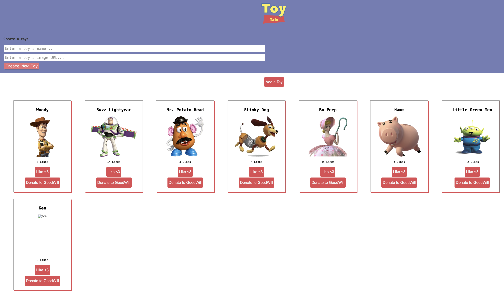

# Toy Tales

A fun little React app where you can view, add, like, and delete toys.  It’s all connected to a fake backend using a `json-server`.
---
## Table of Contents

- [Demo](#demo)
- [Setup](#️setup)
- [Testing](#testing)
- [Features](#features)

---

## Demo

---

## Setup

1. Fork and clone the repo.
2. Install dependencies: `npm install`
3. Run backend server: `npm run server`
4. Run the frontend: `npm run dev` 

## Testing

- To run the tests: `npm run test`

## Features

1. See all the toys from the backend on page load
2. 	Add a new toy through a form (starts with 0 likes)
3.	Like a toy by clicking a heart button 
4.	Delete (or rather “donate”) a toy and it disappears from the list